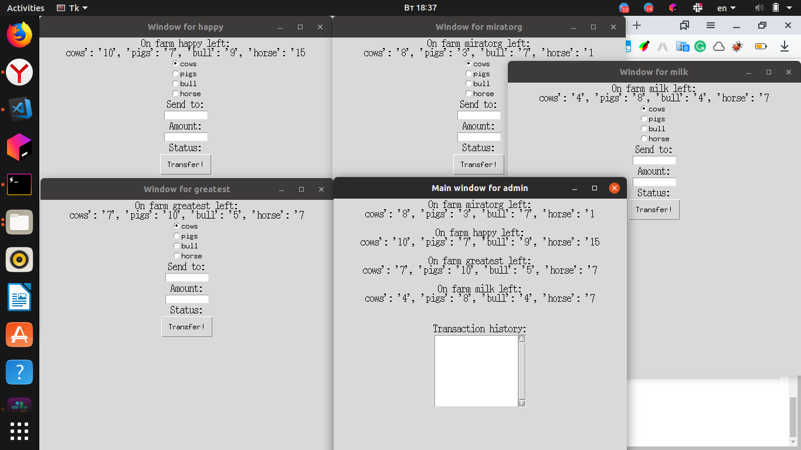
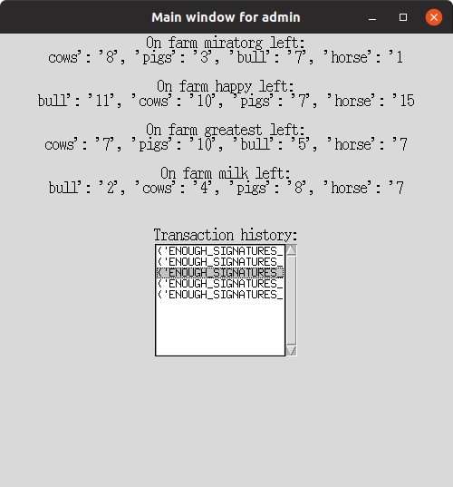
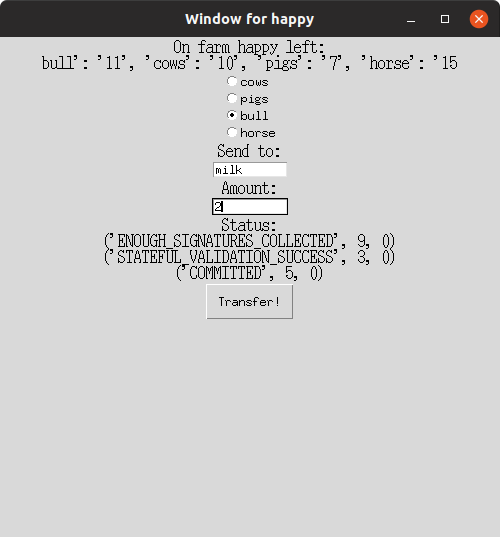

# Iroha-Python

***

Simple demonstration of iroha app with GUI

This example was created for the `Basics of Grid and Cloud Computing` course.

You can find more detailed information and demo in the [presentation](https://1drv.ms/p/s!ApBGaBQhXatygZg-zsa-chLzv9QiBA).

***

### How to launch

* clone this repo: `git clone https://github.com/bruce-willis/Iroha-Python.git`
* install python requirements: `pip install -r requirements.txt`
* Run `start_docker.sh` to start Docker container
* Execute this command inside container:
```sh
irohad --config config.docker --genesis_block genesis.block --keypair_name node0 --overwrite_ledger
```
This will start irohad daemon
*Tip:* if you want to start completely from the scratch execute: `do_all_dirty_work.sh`
* Open `IrohaPy.ipynb` and run all cells (*recommended*, but can be started via  `python IrohaPy.py`)

***

### 

Screenshots:

* Overview:


* Admin ui with transaction history:


* user's ui:
